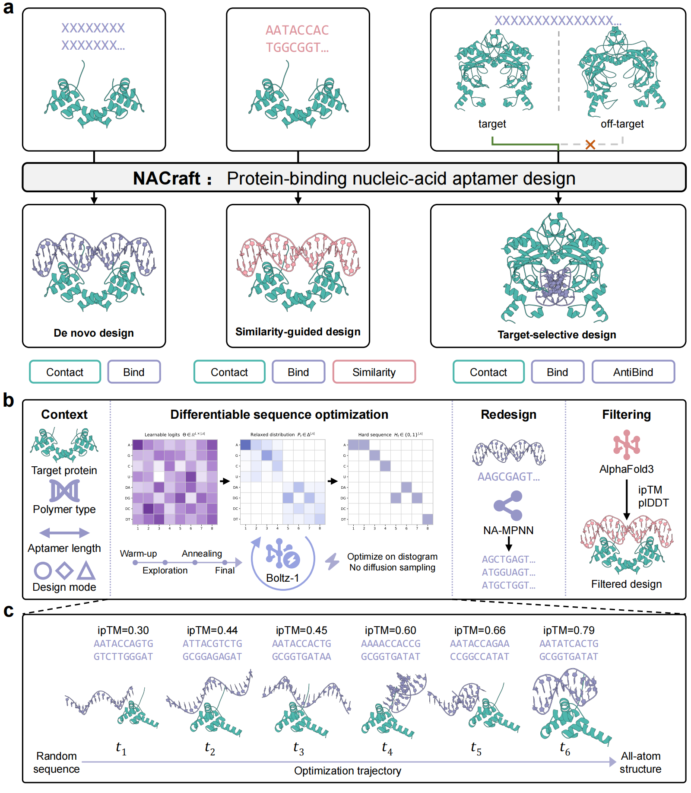
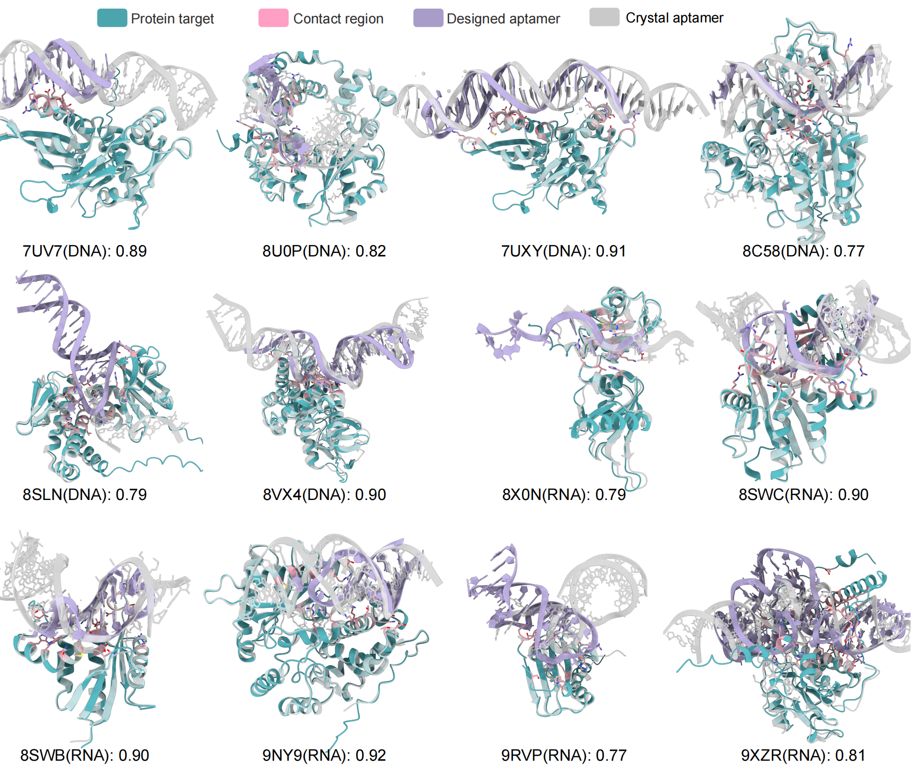

# NACraft: Programmatic nucleic-acid aptamer design via all-atom structure-model feedback

[](LICENSE)
[](https://www.python.org/)

<!-- vim-markdown-toc GFM -->

* [Overview](#overview)
* [Method overview](#method-overview)
* [Repository layout](#repository-layout)
* [Requirements](#requirements)
* [Installation](#installation)
    * [Install Boltz-1](#install-boltz-1)
    * [Install NA-MPNN](#install-na-mpnn)
    * [Install AlphaFold 3](#install-alphafold-3)
* [Quick start](#quick-start)
    * [Similarity-guided design](#similarity-guided-design)
    * [Target-selective design](#target-selective-design)
* [Reusing MSA and templates](#reusing-msa-and-templates)
* [Slurm execution](#slurm-execution)
* [Outputs](#outputs)
* [AF3 compatibility](#af3-compatibility)
* [Verification](#verification)
* [Acknowledgements](#acknowledgements)
* [LICENSE](#license)
* [Citation](#citation)

<!-- vim-markdown-toc -->

## Overview

NACraft is a training-free, all-atom hallucination method for designing RNA and DNA aptamers against protein targets. It optimizes a relaxed nucleotide sequence by backpropagating through the Boltz-1 distogram head; diffusion is not run during sequence optimization. The optimized sequence is subsequently refolded, optionally diversified with NA-MPNN, and independently validated with AlphaFold 3 (AF3).

The framework turns a molecular design objective into a differentiable sequence-search problem. A design context specifies the target protein, nucleic-acid alphabet, sequence length and objective terms; Boltz-1 then provides structure-model feedback to optimize nucleotide logits. The resulting sequences can be refolded and diversified with NA-MPNN before independent AF3 validation. The same protocol supports de novo, similarity-guided and target-selective aptamer design for both RNA and DNA.

<div align="center">

<p><em>Overview of the NACraft design protocol and design modes.</em></p>
</div>

Representative NA-12 structures illustrate the all-atom complexes recovered across RNA and DNA targets after optimization, redesign and AF3 validation.

<div align="center">

<p><em>Representative AF3-supported NA-12 aptamer structures.</em></p>
</div>

## Method overview

NACraft uses four stages:

1. **Design context statement**: provide the target protein sequence, nucleic
   acid type and length, binding-site residues, and an optional alternative
   target.
2. **Differentiable sequence optimization**: optimize nucleotide logits using
   Boltz-1 distogram feedback without structure diffusion in the optimization
   loop.
3. **Refolding and sequence diversification**: generate an all-atom complex
   for the optimized sequence and optionally redesign the aptamer with
   NA-MPNN.
4. **Independent validation**: refold retained sequences with AF3 and evaluate
   ipTM, pLDDT, iPAE, and protein-target RMSD.

The same protocol supports three design modes:

- **de novo design** uses random sequence initialization and
  `LigandContactLoss` against the intended target;
- **similarity-guided design** initializes from a supplied sequence and adds
  `SequenceSimilarityLoss`;
- **target-selective design** applies `LigandContactLoss` to the intended
  target and `AntiLigandContactLoss` to an alternative target while optimizing
  one shared aptamer sequence.

Sequence gradients always come from Boltz-1. `predictor: boltz` and `predictor: af3` only select the model used for post-optimization refolding; AF3 gradient backpropagation is not part of NACraft.

## Repository layout

```text
.
|-- NACraft/
|   |-- main.py                 command-line entry point
|   |-- designer.py             optimization, refolding, and redesign
|   |-- losses.py               differentiable objective functions
|   |-- utils/                  model adapters, geometry, and target RMSD
|   |-- boltz/                  NACraft-compatible Boltz-1 source
|   |-- LigandMPNN/             retained protein-redesign compatibility code
|   |-- NA-MPNN/                upstream NA-MPNN Git submodule
|   `-- experiments/            released workflows, configs, and target structures
|-- figures/                   README overview and representative structures
|-- requirements.txt            core runtime dependencies
|-- .gitmodules
`-- LICENSE
```

The NACraft-compatible Boltz-1 source is included because sequence gradients depend on this implementation. Boltz checkpoints and CCD data, AF3 source and parameters, sequence databases, MSA/template caches, and generated outputs are not included. The NA-MPNN submodule and retained LigandMPNN code are distributed with the repository, but their model checkpoints are not. Released experiment workflows are indexed in [`NACraft/experiments/README.md`](NACraft/experiments/README.md).

## Requirements

- Linux and an NVIDIA GPU with a working CUDA installation;
- Python 3.10;
- the bundled NACraft-compatible Boltz 0.4.1 source and separately downloaded
  Boltz-1 checkpoint/CCD assets;
- NA-MPNN and its design checkpoint when sequence diversification is enabled;
- AF3, its parameters, and an Apptainer/Singularity image when AF3 validation
  is enabled;
- Slurm for the released production scripts.

The repository does not redistribute model weights, Boltz CCD data, AF3 software, or AF3 databases. Install and use each dependency under its upstream license and terms.

## Installation

Clone NACraft and its NA-MPNN submodule:

```bash
git clone --recurse-submodules <NACRAFT_REPOSITORY_URL>
cd NACraft
conda create -n nacraft python=3.10 -y
conda activate nacraft
```

Install PyTorch for the CUDA version available on the system, then install the core dependencies:

```bash
pip install torch --index-url https://download.pytorch.org/whl/cu126
pip install -r requirements.txt
```

If the repository was cloned without submodules:

```bash
git submodule update --init --recursive
```

### Install Boltz-1

NACraft includes the Boltz 0.4.1 source used by its differentiable optimization loop. Install this copy in editable mode so that NACraft uses the bundled gradient-compatible implementation:

```bash
pip install -e NACraft/boltz
```

This command is also included in `requirements.txt`. Do not replace the bundled source with an arbitrary Boltz release: local changes are retained to preserve the sequence-gradient path used by NACraft.

Download the official Boltz-1 assets into a local, untracked directory:

```bash
mkdir -p model_assets/boltz
python -c 'from pathlib import Path; from boltz.main import download; download(Path("model_assets/boltz"))'
export NACRAFT_BOLTZ_CACHE="model_assets/boltz"
```

`NACRAFT_BOLTZ_CACHE` must contain `boltz1_conf.ckpt` and `ccd.pkl`. If the variable is unset, NACraft also checks `NACraft/boltz/` and `~/.boltz/` for backward compatibility.

### Install NA-MPNN

The submodule is fixed to the revision used by NACraft. Install its inference dependencies in the same environment:

```bash
conda install -c conda-forge openbabel prody pyarrow pandas -y
```

Obtain the NA-MPNN design checkpoint from the upstream project and place it at:

```text
NACraft/NA-MPNN/models/design_model/s_19137.pt
```

See the upstream instructions in [`NACraft/NA-MPNN/README.md`](NACraft/NA-MPNN/README.md). NA-MPNN is optional; set `--ligandmpnn_seqs 0` to run optimization and refolding without redesign.

The inherited LigandMPNN integration is retained for protein-redesign compatibility, but it is not used in the released RNA/DNA aptamer experiments. Its checkpoints are not distributed. Download the upstream parameters when that optional branch is needed:

```bash
bash NACraft/LigandMPNN/get_model_params.sh NACraft/LigandMPNN/model_params
```

The retained code follows the upstream LigandMPNN MIT license in [`NACraft/LigandMPNN/LICENSE`](NACraft/LigandMPNN/LICENSE).

### Install AlphaFold 3

AF3 is used only for independent validation. Follow the official AF3 installation guide to clone the source, request model parameters directly from Google DeepMind, download the genetic databases, and build a Docker or Apptainer/Singularity image:

```bash
git clone https://github.com/google-deepmind/alphafold3.git third_party/alphafold3
cd third_party/alphafold3
./fetch_databases.sh ../../model_assets/af3_databases
docker build -t alphafold3 -f docker/Dockerfile .
cd ../..
```

Model parameters must be requested and downloaded according to the upstream terms; NACraft does not provide them. Configure the NACraft AF3 adapter with environment variables:

```bash
export AF3_CODE_DIR="third_party/alphafold3"
export AF3_MODEL_DIR="model_assets/af3_models"
export AF3_DB_DIR="model_assets/af3_databases"
export AF3_SIF_PATH="model_assets/containers/alphafold3.sif"
export APPTAINER_BIN="apptainer"
```

An extracted sandbox can be used instead of a SIF:

```bash
export AF3_SANDBOX_DIR="model_assets/containers/alphafold3_sandbox"
```

The adapter detects the official `run_alphafold.py` entry point. Validate the local AF3 installation independently before launching NACraft benchmark jobs.

## Quick start

Run NACraft from the repository root. Create a configuration such as `configs/example_rna.yaml`:

```yaml
polymer_type: rna
predictor: boltz
num_states: 1
length: 50
motifs: []
states:
  - ["protein:TARGET_PROTEIN_SEQUENCE"]
losses:
  - type: LigandContactLoss
    state: 0
```

Then optimize one sequence and generate two NA-MPNN variants:

```bash
python NACraft/main.py \
  --config configs/example_rna.yaml \
  --num_designs 1 \
  --ligandmpnn_seqs 2 \
  --outpath outputs/example_rna
```

Use `polymer_type: dna` for DNA aptamers. `--ligandmpnn_seqs 0` disables NA-MPNN redesign.

### Similarity-guided design

The initial and reference sequences must match the requested design length:

```yaml
polymer_type: rna
predictor: boltz
num_states: 1
length: 12
init_seq: ACGUACGUACGU
motifs: []
states:
  - ["protein:TARGET_PROTEIN_SEQUENCE"]
losses:
  - type: LigandContactLoss
    state: 0
  - type: SequenceSimilarityLoss
    state: 0
    target_sequence: ACGUACGUACGU
    strength: 0.3
```

`--init-seq` overrides `init_seq` in the YAML file.

### Target-selective design

```yaml
polymer_type: rna
predictor: boltz
num_states: 2
length: 50
motifs: []
states:
  - ["protein:INTENDED_TARGET_SEQUENCE"]
  - ["protein:ALTERNATIVE_TARGET_SEQUENCE"]
losses:
  - type: LigandContactLoss
    state: 0
  - type: AntiLigandContactLoss
    state: 1
```

The nucleotide logits are shared across both contexts. The positive context promotes binding to the intended target, whereas the negative context penalizes binding to the alternative target.

## Reusing MSA and templates

Run the AF3 data pipeline once for each unique target-protein sequence, then reuse the extracted MSA/template cache during both NACraft refolding and AF3 validation:

```bash
python NACraft/main.py \
  --config configs/example_rna.yaml \
  --presearch-json data/presearch/out/index.json \
  --presearch-outdir data/presearch/out \
  --outpath outputs/example_rna
```

The cache is keyed by the exact protein sequence. Paths stored in `index.json` are re-anchored under `--presearch-outdir`, allowing the cache to be moved between clusters. The portable presearch workflow is documented in [`NACraft/experiments/drylab_benchmark/presearch_bundle/README.md`](NACraft/experiments/drylab_benchmark/presearch_bundle/README.md).

## Slurm execution

All production inference should be submitted through Slurm. Slurm scripts use paths relative to the repository and accept environment-variable overrides; they do not contain user- or cluster-specific paths. Submit from the relevant experiment directory so relative log paths resolve consistently:

```bash
cd NACraft/experiments/OGA
mkdir -p logs work
export OGA_RUN_ROOT="work"
export NACRAFT_PYTHON="python"
sbatch --array=0-99 scripts/slurm_multilength_design.sh
```

For a sharded design campaign, `--num_workers` is the total shard count and `--worker_id` is the zero-based shard index. `--skip_existing` makes retries resumable. Do not add a Slurm array throttle unless required by the cluster.

The OGA workflow and dry-lab benchmark have dedicated instructions:

- [`NACraft/experiments/OGA/README.md`](NACraft/experiments/OGA/README.md)
- [`NACraft/experiments/drylab_benchmark/README.md`](NACraft/experiments/drylab_benchmark/README.md)

Paper-only dry-lab analysis scripts, rendered figures, tables and result reports are maintained in the separate analysis workspace and are intentionally not part of this release. The release contains the benchmark inputs and the scripts needed to run and collect the experiments.

The exact release inputs are stored with their workflows. In particular, `NACraft/experiments/drylab_benchmark/configs/` contains the NA-12, protein-target and target-selective design configurations, while `NACraft/experiments/drylab_benchmark/targets/` contains their reference structures and manifests. OGA504 inputs are documented under `NACraft/experiments/OGA/`.

## Outputs

Each `designN/` directory contains the outputs enabled for that run:

- `optimization_trace.tsv`: sequence, total loss, and weighted/raw objective
  values at every optimization step;
- `state*_sample*.pdb` and `state*_sample*.cif`: post-optimization complex
  structures;
- `state*.pkl`: model outputs and confidence fields;
- `nampnn/`: redesigned sequences and Boltz-refolded NA-MPNN structures.

AF3 collectors retain each predicted-structure path and report ipTM, pLDDT, iPAE, and `target_RMSD`. Target RMSD compares the protein target after AF3 refolding with the supplied target structure and can be used as a structural validity gate before interface-confidence ranking.

Benchmark analysis retains all parse-valid candidates. Thresholded success rates and downstream multi-metric candidate triage are separate analyses, not a universal filter applied to every benchmark summary.

## AF3 compatibility

`NACraft/utils/af3_utils.py` first looks for the official `AF3_CODE_DIR/run_alphafold.py`. It converts NACraft's single-task list JSON to the official object form and invokes predict-only AF3 with the configured model, database, and container paths. For compatibility with existing cluster installations, a local `launch.py` can still be selected by setting `AF3_ENTRYPOINT=launch.py`; the legacy launcher must accept `--input_json`, `--output_dir`, `--run_data_pipeline`, `--gpus`, `--exp_name`, and `--num_diffusion_samples`.

Both entry points must preserve standard `*_model.cif`, `*summary_confidence*.json`, and `*confidences*.json` files. AF3 model parameters must only be obtained directly from Google DeepMind.

## Verification

The release does not run GPU inference during installation. Check imports and the command-line interface before submitting jobs:

```bash
python -c 'import boltz, gemmi, torch; print("core imports OK")'
python NACraft/main.py --help
```

Then run one Slurm design with `--num_designs 1` in the target cluster before launching a full campaign.

## Acknowledgements

We acknowledge the developers of Boltz-1, AlphaFold 3, NA-MPNN and LigandMPNN for making the underlying structure-prediction and sequence-design software available. We also thank the open-source scientific-computing community whose libraries support the NACraft implementation.

## LICENSE

NACraft is released under the [MIT License](LICENSE).

## Citation

If you find our work helpful, please star and cite our paper:
```bibtex
@article{zhu_nacraft_2026,
	title = {{NACraft}: {Programmatic} nucleic-acid aptamer design via all-atom structure-model feedback},
	author = {Zhu, Heqin and Wang, Jiaqi and Zhao, Weibo and XU, YUZHI and Su, Huang and Wang, Jianmin and Wang, Qianhan and Yu, Yuntao and You, Ziyi and Du, Gang and Heng, Pheng Ann and Zhang, Liqin and Zhang, Odin},
	journal = {bioRxiv},
	year = {2026},
	publisher = {Cold Spring Harbor Laboratory},
	url = {https://www.biorxiv.org/content/early/2026/08/18/2026.08.15.744087},
	doi = {10.64898/2026.08.15.744087},
}
```
